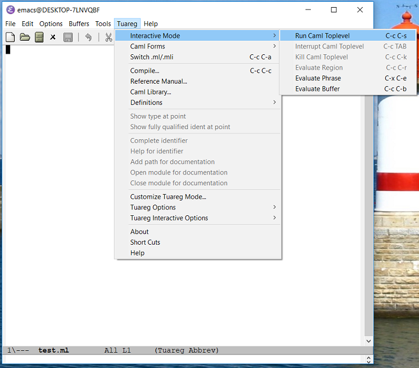
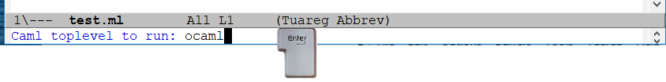
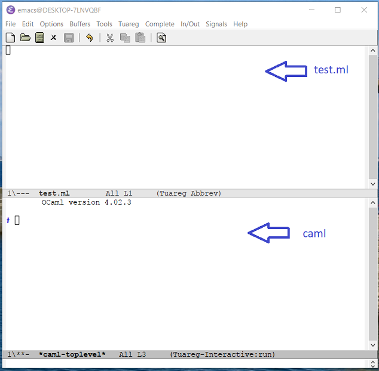
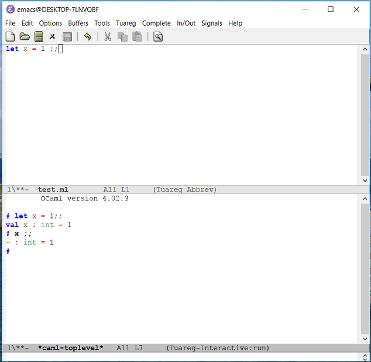

# Using Caml with Emacs

## Opening a file

- Open `emacs` with a `.ml` file
- The `Tuareg` menu can now be found on the top right. Select `Interactive Mode > Run Caml Toplevel` (or `ctrl-c ctrl-s`). Warning: the Tuareg mode is only available with `.ml` files.

- Type enter to validate the launch of the ocaml console

- The window is split into two "buffers":
    
    
    - Above is the `.ml` file: Caml phrases can be entered and sent to the top-level below so they can be evaluated.
    - Below is the Caml top-level where the evaluations can be seen.

## Shortcuts

C = ctrl

M = meta (alt)

S = shift

The bottom line shows the current command. If the current command does not work or is 'stuck' (a strange command in the command line): C-g C-g (until the command is canceled: Quit is displayed in the command line).

- Caml:
    - C-c C-s: run a toplevel
    - C-c C-e or C-M-x: send the current phrase to evaluation
    - C-c C-r: send the current selection to evaluation
- File
    - C-x C-s: save file
    - C-x C-w: save file as
    - C-x s: save all files
    - C-x C-f: open file
- Edition:
    - C-space:start selection
    - M-w or C-inser : copy
    - C-y or S-inser : paste then M-y to make choice
    - C-w : cut
    - C-d : delete the character under cursor
    - C-k : delete the rest of the line
    - C-_ : undo
- Buffers:
    - C-x o: other buffer
    - C-x 2: split buffer vertically
    - C-x 3: split buffer horizontally
    - C-x 1: back to one buffer
- Various:
    - C-g C-g: quit the running/entered command
    - C-h b: Show a list of all defined keys (commands)
    - C-h t: start the emacs tutorial
