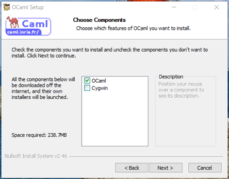
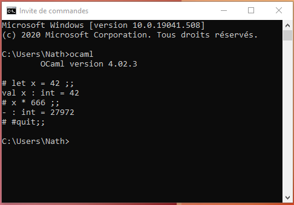
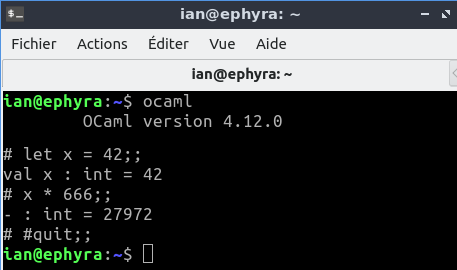

# OCaml - 2024-09

## Try OCaml online

If you do not manage to install Caml, or to use it under emacs, you can try this [online interpreter](https://try.ocamlpro.com/)

## 1. Install OCaml

### Linux - OSX

- Install OPAM + last version of OCaml

  Instructions are here: https://opam.ocaml.org/doc/Install.html#Using-your-distribution-39-s-package-system

  For instance under Ubuntu:

	```bash
	sudo add-apt-repository ppa:avsm/ppa
	sudo apt update
	sudo apt install opam
	opam init
	eval $(opam env)
	```
	
  `opam init`: answer yes to all questions!

  If the installation fails, make sure that `gcc` and `make` are installed. If they are not, they can be installed using: 
	
	```bash
	sudo apt install gcc
	sudo apt install make
	```
	
### Windows 10

> We use here a really old version of Ocaml, but:
> - it works!
> - it is simple to install...
> - Graphics package is included (usefull for one of your practical)

- Download [ocaml-4.02.3-x86_64-mingw64-installer4-opam.exe](https://gitlab.cri.epita.fr/prepa/algorithmique/s1s2-2029_algo/s1-caml/-/blob/main/installation/ocaml-4.02.3-x86_64-mingw64-installer4-opam.exe)
- Start the installation: do not install Cygwin



## 2. Check that OCaml is properly installed (any system)
To check that OCaml is properly installed open a _console_ (on Windows `cmd` in the search field):

- `ocaml`: runs caml!
- `#quit;;` (with the #): quits caml!

 

## 3. Install Ocaml-top or Emacs

Two editors can be used :

- [Ocaml-top](install_ocamltop.md) (easy to use)

- [Emacs](install_emacs.md) (more complete)

VScode can also be used, an online installation can be found here : [https://anthonylick.com/installer-ocaml-avec-vscode/](https://anthonylick.com/installer-ocaml-avec-vscode/)

