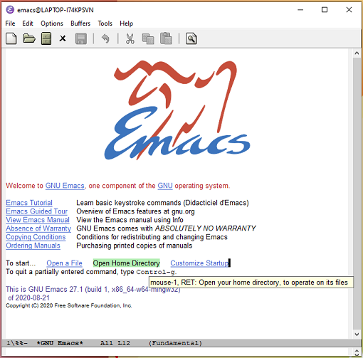
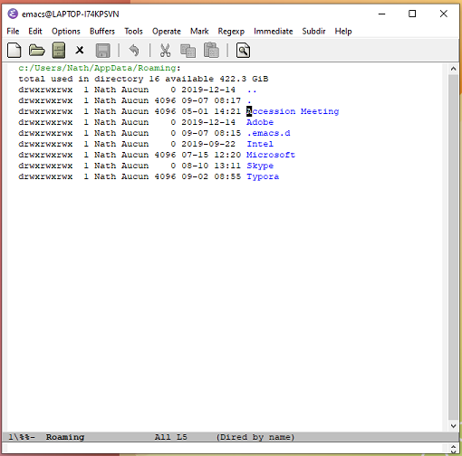
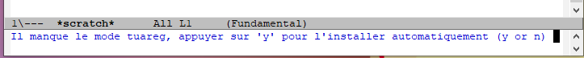
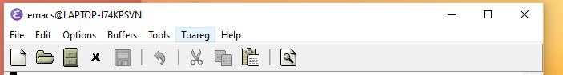
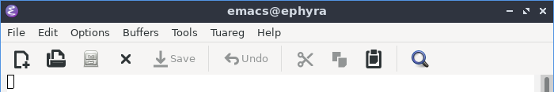

# Install [Emacs](https://www.gnu.org/software/emacs/) + Tuareg

## Using opam (Linux)

- Install Emacs

- Add _tuareg mode_ and _ocp-indent_ to emacs (or you can use the solution for Windows below):

  - Install the packages:

	```bash
	opam install tuareg ocp-indent user-setup --yes
	```
	
  - Configure emacs (modifies the `.emacs`):

    ```bash
    opam user-setup install
    ```


## Windows


1. Install Emacs: 

   - download an installer from http://ftp.gnu.org/gnu/emacs/windows/, choose a file `emacs-$VERSION-x86_64-installer.exe` (for instance, the latest version at this time http://ftp.gnu.org/gnu/emacs/windows/emacs-27/emacs-27.1-x86_64-installer.exe)
   - run it!

2. Add tuareg and ocp-indent:
   - Download the file [`.emacs`](.emacs) -> rename it `.emacs` (delete the `installation_` before the `.`!) 
   - **Find your "Home" directory:** Run Emacs

      
	 
	 click on the link "Open Home Directory", the path is displayed at the top of the result.
	 
	 
	 	
    (For instance, on Windows:
		- c:/Utilisateurs/Nathalie
		- or c:/Users/Nathalie/AppData/Roaming)
	- `.emacs` file: 
		- if you do not have already a `.emacs` file (the first time you launch Emacs) copy the downloaded file to your home directory (tips: you can drag-and-drop it directly in emacs)
		- otherwise, add the content of the downloaded file at the end of your `.emacs`
	- close Emacs

	- Open Emacs again, 
		- it will ask you if you want to install tuareg (at the bottom):
		

	  	  answer `y`
	  	- Then it will ask if you want to install `ocp-indent`: the answer is yes (`y`) again!

# Check that tuareg is properly installed (any system)
To check that the tuareg-mode is properly installed: open in emacs a new file with the extension ml: a new item "Tuareg" must appear in the menu bar





# Next step: how to use it?

Check the [explanations to use emacs for Caml](Caml_with_Emacs.md) (applies on school computers).
